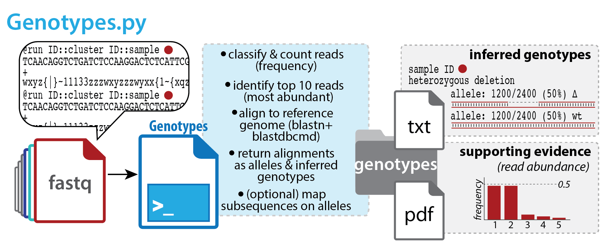
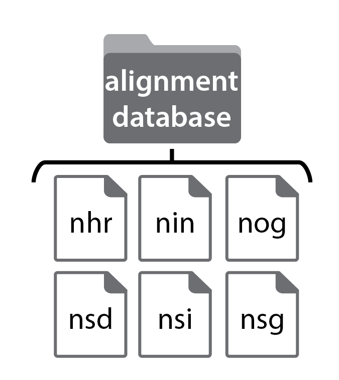
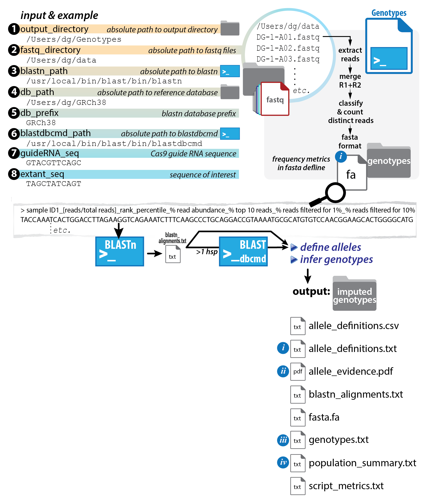
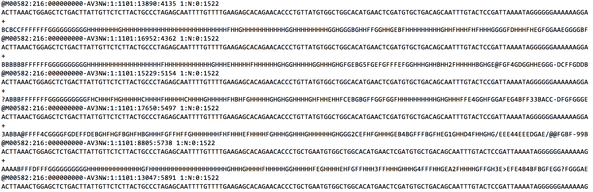
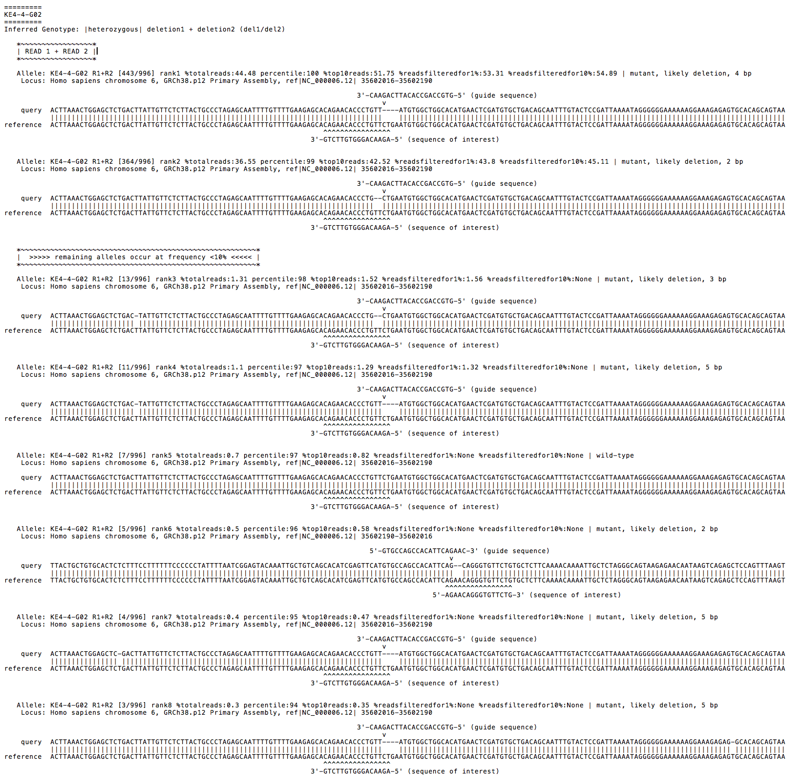
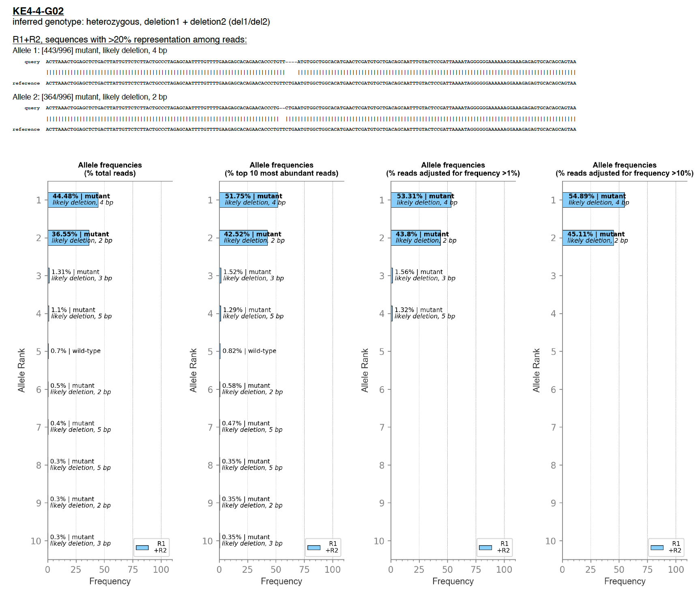

# <span style="color:blueviolet">Genotypes.py</span>

Define alleles for deeply sequenced genetic loci (PCR amplicons), and summarize loss or gain of transcription factor binding site (TFBS) motif matches relative to reference DNA sequence(s).  
<br/> 
## <span style="color:blueviolet">Table of contents</span>
* [Background](#background)  
* [Features](#features)  
* [Requirements](#requirements)  
* [Synopsis](#synopsis)  
* [System setup](#system-setup)  
	* [Option 1: Virtual machine](#virtual-machine)    
	* [Option 2: Direct install](#direct-install)    
		* [2.1 Python 3 setup](#21-python-3-setup)  
			* [Python 3 (required)](#python-3-required)  
			* [Anaconda (Optional: Python 3 with Jupyter Notebook in one)](#anaconda-optional-python-3-with-jupyter-notebook-in-one)  
				* [Anaconda on Mac](#anaconda-on-mac)  
				* [Anaconda on Linux](#anaconda-on-linux)  
				* [Anaconda on Windows](#anaconda-on-windows)  
			* [Jupyter Notebook (optional)](#jupyter-notebook-optional)  
		* [2.2 GitHub repository](#22-github-repository)  
		* [2.3 Python 3 libraries](#23-python-3-libraries)  
			* [Libraries in default python](#libraries-in-default-python)  
			* [Libraries in virtual python environment](#libraries-in-virtual-python-environment)  
		* [2.4 External dependencies](#24-external-dependencies)
* [Code launch notes](#code-launch-notes)  
	* [Launching .py program](#launching-py-program)
		* [Command line .py](#command-line-py)
		* [Command line .py in virtual environmnet](#command-line-py-in-virtual-environment)
	* [Launching .ipynb program](#launching-ipynb-program)
		* [Jupyter Notebook .ipynb](#jupyter-notebook-ipynb)
		* [Jupyter Notebook .ipynb in virtual environmnet](#jupyter-notebook-ipynb-in-virtual-environment)
* [Operation notes](#operation-notes)  
* [Input notes](#input-notes)  
* [Output notes](#output-notes)  
* [Visual summary of key script operations](#visual-summary-of-key-script-operations)  
* [Status](#status)  
* [Contact](#contact)  
  

## <span style="color:blueviolet">Background</span>  

This script returns allele definitions (and inferred genotypes) for amplicons sequenced by Illumina® short-read ('next-generation') sequencing technologies. Users input demultiplexed fastq files for sequenced amplicons and specify a BLASTN database to be used as an alignment reference, and the script completes allele definitions (wild-type, deletion, insertion, substitution, *etc.*) for the sequenced locus based on relative read abundance in each fastq file. Based on allele definitions, the script also imputes genotype (homozygous, heterozygous) across the sequenced locus for each sample.
<br clear="all" />

<br clear="all" />  

## <span style="color:blueviolet">Features</span>  
* Automates allele definitions and imputes genotypes at specific loci, for amplicons deeply sequenced on Illumina® platforms
* Key input: demultiplexed fastq files
* Key outputs: sequence alignments for candidate alleles (reads ranked by abundance), with optional DNA sub-sequence(s) mapped on alignments (*e.g.*, Cas9 guide RNA sequence(s), DNA sub-sequence(s) to test for presence/ablation); imputed genotypes

## <span style="color:blueviolet">Requirements</span>  
* Python 3.7 or higher - instructions for install below
* Python libraries (numpy, pip, psutil, scipy, setuptools, and wheel) - instructions for install below
* BLASTN & BLASTDBCMD (NCBI) (available for OS-appropriate download as part of BLAST+ suite @ <a href="https://blast.ncbi.nlm.nih.gov/Blast.cgi?PAGE_TYPE=BlastDocs&DOC_TYPE=Download">Download BLAST Software and Databases</a>) - For further notes see also [2.4 External dependencies](#24-external-dependencies) for exta notes on downloading & installing external dependencies (BLAST)

  
## <span style="color:blueviolet">Synopsis</span>
**This script returns imputed genotypes for sample-specific amplicons deeply sequenced on Illumina® sequencing platforms.**
>(see '[Output notes](#output-notes)' for file output details).  


**Users are asked for paths to (1) an output directory, (2) fastq directory (sample sequence sources), (3) BLASTN executable, and (4) BLAST reference sequence database (+prefix common to database files), as well as (optional) DNA sub-sequence(s) to query in read alignments (*e.g.*, Cas9 guide RNA sequence(s), DNA test sequence(s)).**

>(see '[Input notes](#input-notes)' for details).
    
For further usage details, please refer to the following manuscript:  
>*Ehmsen, Knuesel, Martinez, Asahina, Aridomi, Yamamoto (2021)*
    
Please cite usage as:  
>Genotypes.py  
>*Ehmsen, Knuesel, Martinez, Asahina, Aridomi, Yamamoto (2021)*


## <span style="color:blueviolet">System setup</span>   

### <span style="color:mediumorchid">Virtual machine<span>   
---
#### <span style="color:mediumorchid">Alleles\_and\_altered\_motifs.ovf</span>   

The programs are available for use either individually or packaged into a virtual machine which can be run on Mac, Linux, or Windows operating systems. The "Alleles_and_altered_motifs" virtual machine comes pre-installed with BLAST, MEME, the full hg38 genome BLAST database, test datasets, and all the external dependencies needed to run SampleSheet, CollatedMotifs, and Genotypes. Windows users are encouraged to use the virtual machine to run CollatedMotifs because the MEME suite software upon which CollatedMotifs relies is not natively supported on Windows OS).

* Detailed instuctions on Virtual machine download and setup at <a href="https://doi.org/10.5281/zenodo.3406861">Download Alleles\_and\_altered\_motifs virtual machine</a> from Zenodo,  DOI 10.5281/zenodo.3406861)

* Note: Running the virtual machine requires virtualization software, such as Oracle VM VirtualBox available for download at <a href="https://www.virtualbox.org/">Download virtualbox Software</a>) https://www.virtualbox.org/


Linux and Mac users can also follw the steps below to install SampleSheet, Genotypes, and CollatedMotifs. If you are running Windows you can follow the steps below to install SampleSheet and Genotypes (without CollatedMotifs).


### <span style="color:mediumorchid">Direct install<span>  
---
#### <span style="color:mediumorchid">2.1. Python 3 setup</span>

<span style="color:mediumorchid"> Firts confirm that Python 3 (required) and Jupyter Notebook (optional) are available on your system, or download & install by following the steps below</span>   


Mac and Linux OS generally come with Python pre-installed, but Windows OS does not.  Check on your system for the availability of Python version 3.7 or higher by following guidelines below:  
 
- First open a console in Terminal (Mac/Linux OS) or PowerShell (Windows OS), to access the command line interface.  
 
-  Check to see which version of Python your OS counts as default by issuing the following command (here, `$` refers to your command-line prompt and is not a character to be typed):  
     
	`$ python --version` 
	 
 	- If the output reads `Python 3.7.3` or any version >=3.7, you are good to go and can proceed to [Jupyter Notebook (optional)](#jupyter-notebook-optional).  
 
 	- If the output reads `Python 2.7.10` or anything below Python 3, this signifies that a Python version <3 is the default version, and you will need to check whether a Python version >=3.7 is available on your system.  
 		- To check whether a Python version >=3.7 is available on your system, issue the following command:  
 
 			`$ python3 --version`  
 
 		- If the output finds a Python version >=3.7 (such as `Python 3.7.3`), you are good to go and can proceed to [Jupyter Notebook (optional)](#jupyter-notebook-optional).
		- If the output does *not* find a Python version >3.7, use one of the following two options to download and install Python version >=3.7 on your computer:  

##### <span style="color:mediumorchid">Python 3 (required)</span>
Option 1) Install Python 3 prior to Jupyter Notebook **This option is recommended for most users**   
   
* Go to the following website to download and install [Python](https://www.python.org/downloads/) https://www.python.org/downloads/  
	* Select "Download the latest version for X", and then follow installation guidelines and prompts when you double-click the downloaded package to complete installation.  
	* Once you have downloaded and installed a Python 3 version >=3.7, double-check in your command-line that Python 3 can be found on your system by issuing the following command:  
 	
 		`$ python3 --version` 
 		
	* The output should signify the Python version you just installed.  Proceed to [Jupyter Notebook (optional)](#jupyter-notebook-optional).


##### <span style="color:mediumorchid">Anaconda (Optional: Python 3 with Jupyter Notebook in one)</span>
 
Option 2) To install Python 3 and Jupyter Notebook (together as part of Anaconda package)    
   
* [Anaconda (with Jupyter Notebook) Download & Installation](https://jupyter.readthedocs.io/en/latest/install/notebook-classic.html) https://jupyter.readthedocs.io/en/latest/install/notebook-classic.html
	* Download Anaconda with Python 3, and then follow installation guidelines and prompts when you double-click the downloaded package to complete installation.  

 
###### <span style="color:mediumorchid">Anaconda on Mac</span>
Anaconda with Jupyter Notebook on Mac   

* Anaconda with Jupyter Notebook installed on a Mac/Linux OS will install the “Anaconda-Navigator” application in Applications folder. Within the Anaconda-Navigator application the user will find:

	>Jupyter Notebook  


* Jupyter Notebook can be launched by clicking the "Launch" icon from within the Anaconda-Navigator
  			- Alternatively, Jupyter Notebook can be launched in terminal by one of the following commands: `$ jupyter notebook` or `$ jupyter-notebook` (version/system specific) to open Jupyter Notebook through a selected internet browser (Google Chrome and FireFox have been tested)
 			
###### <span style="color:mediumorchid">Anaconda on Linux</span>
Anaconda with Jupyter Notebook on Linux  

* To install Anaconda on Linux, open terminal and navigate to the folder where Anaconda script (for example Anaconda3-2020.11-Linux-x86_64.sh) was downloaded.  
	* Change the permissions to allow script execution with the chmod +x command for example:
  	`$ chmod +x Anaconda3-2020.11-Linux-x86_64.sh` 
	* Open the shell script with the ./ command for example:
  	`$ ./Anaconda3-2020.11-Linux-x86_64.sh`
	* Follow the on-screen prompts and answering "yes" to "Do you whish the installer to initialize Anaconda3 by running conda init? [yes|no]"  
	* When the install is finished, restart terminal to initiate the new settings
	* Anaconda navigator can be opened by the following command in a new terminal
  	`$ anaconda-navigator`
	* Jupyter Notebook can be opened through a selected internet browser (Google Chrome and FireFox have been tested) by selecting "Launch" on the Jupyter Notebook icon from within the home screen of the Anaconda Navigator. Note: (base) may appear at the far left of the terminal when Anaconda is activated
	* To deactivate Anaconda and revert to your default Python settings, run the following terminal command:
  	`$ conda deactivate` 
	* To reactivate Anaconda and allow use of anaconda-navigator, run the following terminal command:
   	`$ conda activate`
   	(base) altered@tfbs:~$ conda deactivate\
	* The version of Python and Jupyter Notebook used by your system will be determined by these commands. For example:

						(base) $ conda deactivate
						$ which python
						/usr/bin/python
						$ which jupyter-notebook
						/usr/bin/jupyter-notebook						
						
						$ conda activate
						(base) $ which python
						/home/altered/anaconda3/bin/python
						(base) $ which jupyter-notebook
						/home/altered/anaconda3/bin/jupyter-notebook

	* If you wish to open new default terminals with anaconda deactivated, add the `$ conda deactivate` command after the conda init code in your .bashrc file and use the `$ conda activate` command prior to use of the `$ anaconda-navigator` when opening Jupyter Notebooks  
	
###### <span style="color:mediumorchid">Anaconda on Windows</span>

Anaconda with Jupyter Notebook on Windows for use with SampleSheet.py and Genotypes.py only:
  			
* Anaconda with Jupyter Notebook installed on a Windows OS will make a separate “Anaconda3 (64 bit)” folder available through the start menu and is kept separate from any other version of Python or Jupyter Notebook on your system. In the Anaconda 3 (64 bit) folder the user will find:

>Anaconda PowerShell Prompt (Anaconda 3)     
>Jupyter Notebook (Anaconda 3)   
   
Jupyter Notebook can be run through Anaconda in Windows by opening the “Jupyter Notebook (Anaconda 3)” program from the start menu or from within the Anaconda PowerShell (Anaconda 3) program by one of the following commands: `$ jupyter notebook` or `$ jupyter-notebook` (version/system specific) to open Jupyter Notebook through a selected internet browser (Google Chrome and FireFox have been tested, Internet Explorer and Microsoft Edge should also be compatible)   
   
			
#### <span style="color:mediumorchid">Jupyter Notebook (optional)<span>
*Note, these steps are not required for running the command line SampleSheet.py, but are necessary to run the browser-based Jupyter Notebook SampleSheet.ipynb*.  

- Jupyter Notebook is *not* generally pre-installed on Mac/Linux OS.  To check whether Jupyter Notebook is available with Python 3 on your machine, issue the following command:   

	`$ which jupyter-notebook` (Mac/Linux OS)  
	`$ where.exe jupyter-notebook` (Windows PowerShell)   
   
- If the output indicates that 'jupyter' is available in the path of your Python 3 installation (such as, `/Library/Frameworks/Python.framework/Versions/3.7/bin/jupyter`), you are good to go and can proceed to **Download the Genotypes repository (or program subset) from GitHub**.  If instead you see an error message indicating that 'jupyter notebook' is not available, issue the following commands using the Python program installer (pip) to install Jupyter:  
  
 	`$ pip3 install --upgrade pip`  
	`$ pip3 install jupyter`  
	
**Confirming Jupyter Notebook**   
  			
 - Users can check Jupyter Notebook locations the terminal (Mac/Linux OS) or Anaconda PowerShell Prompt (Windows OS) by issuing the following command:  
	`$ which jupyter-notebook` (Mac/Linux OS)  
	`$ where.exe jupyter-notebook` (Windows PowerShell)  
	
- If the output indicates that 'jupyter' is available in the path of your Python 3 installation (such as, `/Library/Frameworks/Python.framework/Versions/3.7/bin/jupyter-notebook` (Mac/Linux OS) or `C:\Users\[user]\AppData\Local\Programs\Python\Python37\Scripts\jupyter-notebook.exe` (Windows PowerShell)), you are good to go and can proceed to **Download the Genotypes repository (or program subset) from GitHub**.  


<br>  


#### <span style="color:mediumorchid">2.2. GitHub repository</span>

Download the repository (or program file subset) from GitHub

Genotypes.py can be accessed as a **Jupyter Notebook** or **Python program file** available at [YamamotoLabUCSF GitHub](https://github.com/YamamotoLabUCSF/Genotypes) (https://github.com/YamamotoLabUCSF/Genotypes).  Please note that access to the file through GitHub requires a personal GitHub account.  

* (a) **Create a personal GitHub account** (free)  
	* follow instructions available at [WikiHow: How to Create an Account on GitHub](https://www.wikihow.com/Create-an-Account-on-GitHub) https://www.wikihow.com/Create-an-Account-on-GitHub. 

* (b) **Navigate to the code repository for Genotypes**
	* The code repository contains:
		* the **Jupyter Notebook** file (.ipynb)
		* the **Python program** file (.py)
		* **image files** associated with the Jupyter Notebook
		* a **requirements** file (Genotypes_requirements.txt), used to install all Python dependencies and/or in the creation of a Python virtual environment to run Genotypes (see **[2.3 Python 3 libraries](#23-python-3-libraries)**, below)
		
* (c) **Download** or **clone** the repository to your personal computer:  

	**Download:**   
	* first click on the repository name to access the repository
	* then download the entire repository directory and its associated subdirectories and files (**green download icon, labeled "Code"**)
	* alternatively, download only the target files you need for your intended purposes 
	  * for example, download the **Jupyter Notebook** file (.ipynb), **image files directory**, and **requirements** file if you plan to use only the Jupyter Notebook

	**Clone:**   
	  
	* first click on the repository name	 to access the repository
	* then click on the right-hand arrow of the **green download icon, labeled "Code"**, to access the drop-down menu with **Clone** options (HTTPS or GitHub CLI).
	* If selecting the HTTPS option, copy the indicated URL and paste it at your command-line as an argument to the command 'git clone':  
	`$ git clone https://github.com/YamamotoLabUCSF/Genotypes.git` 

* (d) **Choose a directory location** on your machine where you would like to store the downloaded or cloned repository and its files.  This can be any folder/directory location you like.  **Move the repository files from the directory into which they were downloaded or cloned, into this directory**, if you have not already downloaded or cloned the repository/files directly into your target directory.  

	*Example using command line code*  
	*(directory can be created and accessed using command line prompts)*   
	* For example, on Mac OS:  
	
		* To create an empty directory named 'GenotypesCode', in the 'Documents' directory:*  
	`$ mkdir /Users/yourusername/Documents/GenotypesCode`
		* To navigate to the directory named 'Genotypes':	`$ cd /Users/yourusername/Documents/GenotypesCode`

	* For example, on Windows PowerShell:  
	 
		* To create an empty directory named 'GenotypesCode', in the 'Documents' directory:  
	`$ mkdir ~/Documents/GenotypesCode`
		* To navigate to the directory named 'GenotypesCode':  
	`$ cd ~/Documents/GenotypesCode`

* (e) Transfer the Genotypes repository files to this directory you've created and named
* (f) Navigate to the **Genotypes** repository in the command line
 
<br>  
 
#### <span style="color:mediumorchid">2.3. Python 3 Libraries</span>

Python 3 Libraries (required) and virtual environment (optional)

You are now ready to install **additional Python modules** that Genotypes.py requires for operation.  These Python modules can be installed using one of the following two options:

* Option A) Utilizing the pip3 command to automatically download the required libraries from the Python Package Index repository ([PyPI](https://pypi.org/)) (https://pypi.org/) and install them into your primary Python 3 directory from the requirements file 'Genotypes_requirements.txt'. This method is the most simple to execute and will be outlined first.

* Option B) Installing a Python **virtual environment** (self-contained 'directory' with all the Python modules needed to run Genotypes.py). This method retains your original Python 3 install unchanged, protecting it from any possible library version conflicts that may arise from installing or updating the Genotypes.py required libraries.  
  
##### <span style="color:mediumorchid">Libraries in default Python</span>  
  
**Option A) Direct Python 3 library install**

1. Install the Python modules required by Genotypes.py, using the requirements file named **Genotypes_requirements.txt**, located in the Genotypes repository:
	   
	`$ pip3 install -r Genotypes_requirements.txt`  
	
	pip3 is Python 3's installation manager, and as long as there is an internet connection available, pip3 will access the specified module from PyPI and install it for access by Python 3.
	
2. To check that the required Genotypes.py Python modules were installed properly, now issue the follow command:
	
	`$ pip3 list | grep -E 'certifi|cycler|fpdf|kiwisolver|matplotlib|numpy|pandas|Pillow|psutil|pyparsing|PyPDF2|python-dateutil|pytz|scipy|six'`
	
	If the library install was a success, the output will read the following (note the package version numbers may differ, but all packages should be listed):
	  
  |**Package**|    **Version**|    
  |:--|:--|	
  |certifi|         2020.6.20|  
  |cycler|          0.10.0|  
  |fpdf|            1.7.2|  
  |kiwisolver|      1.2.0|  
  |matplotlib|      3.3.2|  
  |numpy|           1.19.2|  
  |pandas|          1.1.2|  
  |Pillow|          7.2.0|  
  |psutil|          5.7.2|  
  |pyparsing|       2.4.7|  
  |PyPDF2|          1.26.0|  
  |python-dateutil| 2.8.1|  
  |pytz|            2020.1|  
  |scipy|           1.5.2|  
  |six|             1.15.0|  
 
##### <span style="color:mediumorchid">Libraries in virtual python environment</span> 

**Option B) Python 3 library install via a virtual enviornment**

1.  First, install the Python module **virtualenv** ([virtualenv](https://pypi.org/project/virtualenv/)) (https://pypi.org/project/virtualenv/), by issuing the following command at the command line: 
 
	`$ pip3 install virtualenv`  
	
	pip3 is Python 3's installation manager, and as long as there is an internet connection available, pip3 or pip will access the specified module from PyPI (here, virtualenv) and install it for access by Python 3.

2. Next, choose a **directory location** on your machine where you would like to install the files associated with a virtual environment.  This can be any folder/directory location you like (for example, you may have a favorite directory where other Python virtual environments are stored).  Alternatively, simply create the Python virtual environment in the Genotypes directory you created above (in section 2d).  At the command line, navigate to the location of this directory.
	* For example:
		* To navigate to the directory named 'GenotypesCode':  
		`$ cd ~/Documents/GenotypesCode`

3. With this directory set as your working location in the command line, now issue the following commands to **create a virtual environment**:  
	
	(a) Create a Python virtual environment named **Genotypes_env**, specifying that the environment will use Python 3:  
	`$ virtualenv -p python3 Genotypes_env` 
	
	(b) Activate Genotypes_env:   
	`$ source Genotypes_env/bin/activate` (Mac/Linux OS)
	or
	`$ .\Genotypes_env\Scripts\activate` (Windows PowerShell) 
			
	(c) You should now see that your command line prompt has changed to indicate that you are in the virtual environment, displaying something along the lines of:  
	`(Genotypes_env) $`
	
	(d) Now install the Python modules required by Genotypes.py, using the requirements file named **Genotypes_requirements.txt**, located in the Genotypes repository:
	   
	`$ pip3 install -r Genotypes_requirements.txt`  	
	
	(e) To check that the required Genotypes.py Python modules were installed properly, now issue the follow command:
	
	`$ pip3 list`
	
	If the virtual environment was set up successfully, the output will read the following (note the package version numbers may differ, but all packages should be listed):  
	
  |**Package**|    **Version**|    
  |:--|:--|	
  |certifi|         2020.6.20|  
  |cycler|          0.10.0|  
  |fpdf|            1.7.2|  
  |kiwisolver|      1.2.0|  
  |matplotlib|      3.3.2|  
  |numpy|           1.19.2|  
  |pandas|          1.1.2|  
  |Pillow|          7.2.0|  
  |psutil|          5.7.2|  
  |pyparsing|       2.4.7|  
  |PyPDF2|          1.26.0|  
  |python-dateutil| 2.8.1|  
  |pytz|            2020.1|  
  |scipy|           1.5.2|  
  |six|             1.15.0|  

4. Finally, Jupyter Notebook needs to be made aware of the Python virtual environment you just created.  To accomplish this, issue the following commands:  

	```$ pip3 install ipykernel```   
	```$ python -m ipykernel install --name=Genotypes_env```  
note administrator privilages may be needed on your system in which case use the following command
	```$ pseudo python -m ipykernel install --name=Genotypes_env```  
followed by your administrator password

*  You should now be ready to **access Genotypes.ipynb** in Jupyter Notebook or at the command line!

*  Just for completeness, to **exit the Python virtual environment and return to your 'native' (default) environment**, simply issue the following command at the command line:

	``$ deactivate`` 
	
	To **re-enter the virtual environment** at any time in the future, you would use the command in 3b:
	
	`$ source Genotypes_env/bin/activate`  (Mac/Linux OS)  
	or  
	`$ rm Genotypes_env -r -fo`  (Widows PowerShell) 


* Also, note that if you'd like **to remove the Genotypes_env at any time**, you can do so by issuing the following command:  

	`$ rm -rf Genotypes_env`  (Mac/Linux OS)  
     or  
	`$ rm SampleSheet_env -r -fo`  (Widows PowerShell)  

	This would delete the virtual environment from your machine.

<br>   

#### <span style="color:turquoise">2.4 External dependencies</span>

*Additional setup*:  

* Locally install **BLASTN** and **BLASTDBCMD** (see Requirements)  

<br clear="all" />

* Download or create a **reference sequence database** (required for BLASTN alignment operations)  
*this can be obtained in one of two ways:*  
  * create custom database from a fasta file containing reference sequence(s) using MAKEBLASTDB (NCBI)  
(details at <https://www.ncbi.nlm.nih.gov/books/NBK279688/>)
  * download pre-formatted NCBI BLAST database (details at <https://www.ncbi.nlm.nih.gov/books/NBK537770/>)  
   

<br clear="all" />  
* See [Requirements](#requirements) 
* *Note, separate installation of these external dependencies is not necessary if using the virtual machine file Alleles\_and\_altered\_motifs.ovf*


**Additional notes on: </sup> BLAST+ suite** available for download @ <a href="https://blast.ncbi.nlm.nih.gov/Blast.cgi?PAGE_TYPE=BlastDocs&DOC_TYPE=Download">Download BLAST Software and Databases</a>)  

* NCBI recommends Mac users install using the ncbi-blast-2.2.18+.dmg file.
* MacOS 10.15 and higher have enhanced secutity that will require extra steps to install the ncbi-blast-2.2.18+.dmg
	* With Mac OS 10.15 or higher, you may encounter a ' "ncbi-blast-2.11.0+.pkg" cannot be opened because it is from an unidentified developer' error.
	* If so, click on the question mark on the bottom left of the error window and follow the on-screen instructions to open the General Security Pane and allow the install.
* The default BLAST install location from the .dmg file is: `/usr/local/ncbi/blast`

<br>  

## <span style="color:blueviolet">Code launch notes</span>  
  
Code is available as a Jupyter Notebook file (**Genotypes.ipynb**) or as a Python program file (**Genotypes.py**) for direct use, or pre-packaged with all dependencies as an Open Virtualization Format file for virtual machines (**Alleles\_and\_altered\_motifs.ovf**).  

### <span style="color:mediumorchid">Python program (Genotypes.py) or Jupyter Notebook (Genotypes.ipynb)</span>

In [System setup](#system-setup) above, you downloaded and installed Python 3 & the Genotypes code repository.  Optionally, you may have also installed Jupyter Notebook & created a Python virtual environment (Genotypes\_env) containing the Python modules that Genotypes.py needs in order to run.  To access Genotypes.py (Jupyter Notebook or Python program file) for interactive work, proceed through guidelines indicated below.  


#### <span style="color:mediumorchid">Launching .py program</span>
##### <span style="color:mediumorchid">Command line .py</span>


* To start the Genotypes.py program directly from the command line, enter the follwing command:

	`$ python3 [path_to_Genotypes.py]/Genotypes.py`

* for example, if you installed Genotypes.py within the GenotypesCode folder on your desktop, the command would be:

	`$ python3 ~/Desktop/GenotypesCode/Genotypes.py`

*  If these steps have been accomplished successfully, you will now encounter the first interactive prompts of Genotypes.py.  Be prepared to provide required input variables as detailed below in **[Input Notes](#input-notes)**.

##### <span style="color:mediumorchid">Command line .py in virtual environment</span>

1.  If you plan to run Genotypes.py using the Genotypes_env Python3 virtual environment from your command line, first navigate to the directory containing **Genotypes.py**.  Prepare access to a Python virtual environment containing appropriate packages required by Genotypes.py, as described in [System setup](#system-setup).  

    (a) Activate Genotypes_env:   
	`$ source Genotypes_env/bin/activate` (Mac/Linux OS)   
	`$ .\Genotypes_env\Scripts\activate` (Windows PowerShell)   
		
	(b) You should now see that your command line prompt has changed to indicate that you are in the virtual environment, displaying something along the lines of:  
	`(Genotypes_env) $`   

2.  To run Genotypes.py, type **python3 Genotypes.py** and hit 'Enter':   
	`(Genotypes_env) $ python3 Genotypes.py`   
	
3.  If these steps have been accomplished successfully, you will now encounter the first interactive prompts of Genotypes.py.  Be prepared to provide required input variables as detailed below in **[Input Notes](#input-notes)**.   


#### <span style="color:mediumorchid">Launching .ipynb program</span>   
##### <span style="color:mediumorchid">Jupyter Notebook .ipynb</span>

*Note*, Jupyter Notebook file requires *Genotypes_img* directory containing six image files to be available in the directory from which the Jupyter Notebook will be opened.   

1.  If you downloaded **Anaconda (with Jupyter Notebook)**, launch the Anaconda-Navigator application.  Click on **Jupyter Notebook** to activate Jupyter Notebook. Otherwise, open Jupyter Notebook with the terminal command `$ jupyter notebook` or `$ jupyter-notebook`  

2.  You will see a new **tab open automatically in your default web browser** (such as Chrome), in which there is a **directory tree** illustrating the current file contents of the **current working** directory.  Navigate to the directory containing **Genotypes.ipynb**.  Click on the **Genotypes.ipynb** file to open it as a Jupyter Notebook.   

3. In the Jupyter Notebook menu bar at the top of the newly opened Genotypes.py Jupyter Notebook file, take the following steps to **specify Genotypes_env as your Python virtual environment** (see [System setup](#system-setup): 3. Create a Python Virtual Environment for Jupyter Notebook):    

	(a) click on the **'Kernel'** tab to open a drop-down menu  
	(b) hover your mouse over **'Change Kernel'** (bottom option of drop-down menu) to identify the kernels available to the Notebook  
	(c) choose **Genotypes_env** as the kernel  
	 
	 If Genotypes\_env does not appear as a kernel option, troubleshooting is needed to either create the CollatedMoitfs\_env virtual environment, or to make Jupyter Notebook aware of the existence of the Genotypes_env virtual environment.

4.  If these steps have been accomplished successfully, you are now ready to use the Genotypes.ipynb Jupyter Notebook.  Be prepared to provide required input variables as detailed below in **[Input Notes](#input-notes)**.
<br>  


## <span style="color:blueviolet">Operation notes</span>
*What does this script do?*  

 1. **classify & count reads:** counts unique read types per well (*i.e.*, sample ID); fastq file name provides the sample name  
 
 
 2. **identify top 10 reads** per sample ID (in terms of read abundance); calculates representation among reads within the well at four levels:
 
   * raw frequency (% read type in question, relative to total reads)  
   * percentile (% of other read types that fall below the frequency of the read type in question)  
   * adjusted frequency @ 1% (% read type in question, relative to reads that occur at >1% total frequency)  
   * adjusted frequency @ 10% (% read type in question, relative to reads that occur at >10% total frequency)  
   
   
 3. **align to reference database:** aligns top 10 reads to reference database using BLASTN  
 *(National Center for Biotechnology Information;
    Altschul S.F. et al. (1990) "Basic local alignment search tool")*    
    
    
 4. **return alignments as alleles & imputed genotypes;**  
 **(optional) map sub-sequence(s) onto alleles:**  
    -  for mutants, map location of Cas9 cut(s) and indel(s) relative to wt,
       if Cas9 guide sequence(s) supplied by user  
    -  map location of test sub-sequence(s) and whether sub-sequence is altered (ablated),
       if test sub-sequence(s) supplied by user  
       
       
 5. **provide overall population statistics:**  
 
   (a) total sample # for which genotypes were imputed  
   (b) distribution of genotypes among samples (homozygous, heterozygous, *etc.*)  
   (c) estimated wild-type *vs.* mutant allele frequencies  
   (d) summary of samples and reads that either had 'no hit' in reference database provided to BLASTN,
       or multiple hits (>1)  
<br clear="all" />        
**Operations overview:** *See 
Input notes' and 'Output notes'*  
Files labeled *i-iv* below: Key output files containing script interpretations of sample alleles & genotypes.

<br clear="all" />
 

## <span style="color:blueviolet">Input notes</span>
You will be prompted for the following user-specific information (up to 8 items):

   **Required** (5 strings specifying directory or executable locations, 1 string specifying sequence database file prefix):  
      <ul>
      <li>where should output files go?</li>
          *path to* **output directory** *for output files*
      <li>where are input files found?</li>
          *path to single directory containing* **demultiplexed fastq files**                                         
      <li>where is BLASTN executable found?</li>
          *path to* **BLASTN** *installation* - default is:   
          `/usr/local/ncbi/blast/bin/blastn`
      <li>where is the reference sequence database used for alignment?</li>
          *path to directory containing six files that compose the* **reference sequence database** *used
    for BLASTN alignments (.nhr, .nin, .nog, .nsd, .nsi, .nsg)*
      <li>what prefix is common to the six files that compose the reference sequence database?</li>
          *prefix common to database files .nhr, .nin, .nog, .nsd, .nsi, .nsg*  
          <li>where is blastdbcmd executable found?</li>
          *path to* **BLASTDBCMD** *installation* - default is:   
          `/usr/local/ncbi/blast/bin/blastdbcmd`
      </ul>
                                                                                                           
   **Optional** (up to 2 lines of comma-separated strings specifying DNA sub-sequence(s):    
 **DNA sub-sequence(s)** to be mapped onto sequence alignments
      <ul>
      <li>**guide RNA sequence** (in 5'-3' DNA representation, excluding PAM sequence)</li>
      <li>**test sequence** (5'-3' sub-sequence motif(s) of interest, to query whether lost or gained in allele(s))</li>
      </ul>  


## <span style="color:blueviolet">Output notes</span>
This script produces **8 output files** in the user-specified output directory.  
These include:  

1. **fasta.fa**  
        (collection of fasta entries representing top 10 most abundant sequences assigned to a single sample ID)  
        
2. **blastn_alignments.txt**  
        (output of blastn operation on fasta.fa)
     
3. **allele\_definitions.txt**  
        (output of script operation on blastn\_alignments.txt, samples returned in order of processing)  
        
4. **allele\_evidence.pdf**  
        (output of script operation on blastn\_alignments.txt, plots of calculated read/allele frequencies)  
        
5. **imputed\_genotypes.txt**  
        (output of script operation on blastn\_alignments.txt, samples returned in ranked order based on  
        genotype imputation)  
        
6. **allele\_definitions.csv**  
        (tabular representation of allele data for all samples)  

7. **population\_summary.txt**  
        (output of script operation on imputed\_genotypes.txt)  
        
8. **script\_metrics.txt**  
        (summary/analysis of script operation metrics [metadata])  

  Directory structure under an output directory specified as 'Genotypes', for example,  
           would contain the following files after Genotypes.py operations:  

           /Genotypes  
                          `-----allele_definitions.csv  
                          `-----allele_definitions.txt  
                          `-----allele_evidence.pdf  
                          `-----blastn_alignments.txt  
                          `-----fasta.fa  
                          `-----imputed_genotypes.txt  
                          `-----population_summary.txt  
                          `-----script_metrics.txt


## <span style="color:blueviolet">Visual summary of key script operations</span>
In short, sequencing data in a sample-specific **fastq file** (*e.g.*, below), are converted to user-interpretable  genotype imputations (**key output files**, below), for 100s to 1000s of samples.    
  

<br clear="all" />  
*example*  

------
#### Key output files:  
##### allele_definitions.txt 
Samples are reported with sequence alignments to document alleles, along with imputed genotypes. 

<br clear="all" />
##### allele_evidence.pdf
Samples are reported with frequency plots as evidence.
  
<br clear="all" />


## <span style="color:blueviolet">Status</span>
Project is:  _finished_, _open for contributions_


## <span style="color:blueviolet">Contact</span>
Created by kirk.ehmsen[at]gmail.com - feel free to contact me!    
Keith Yamamoto laboratory, UCSF, San Francisco, CA.  
