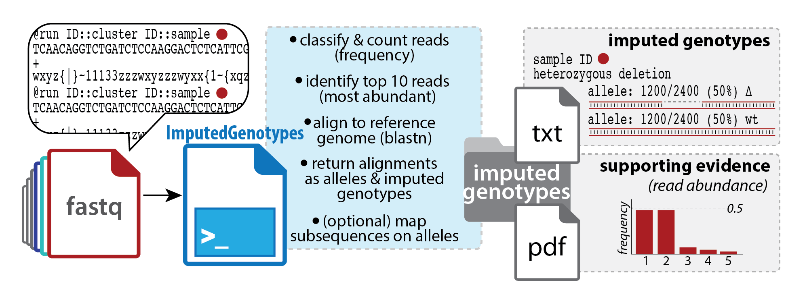
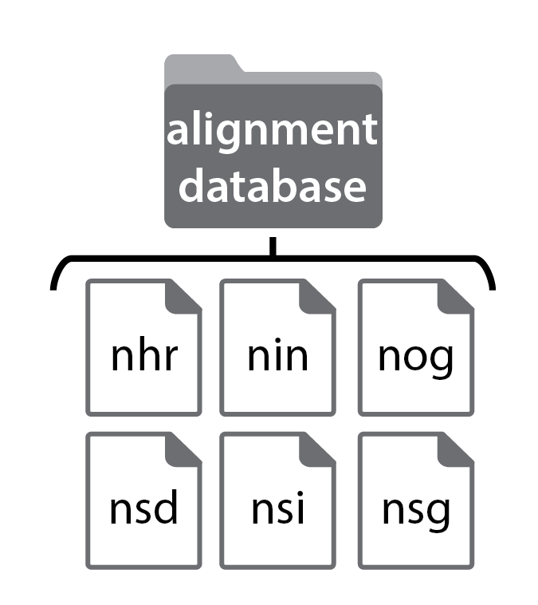
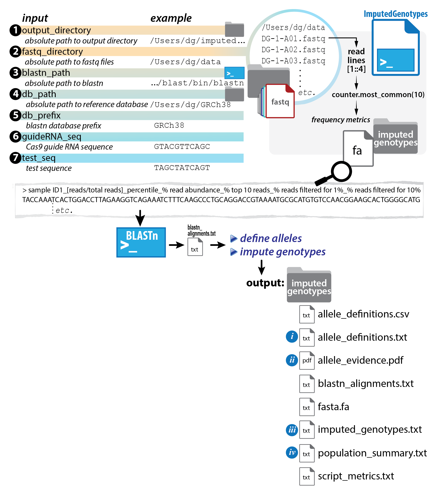
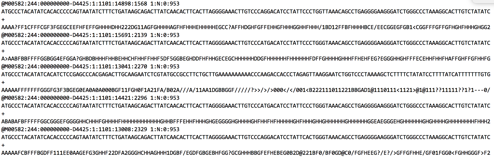
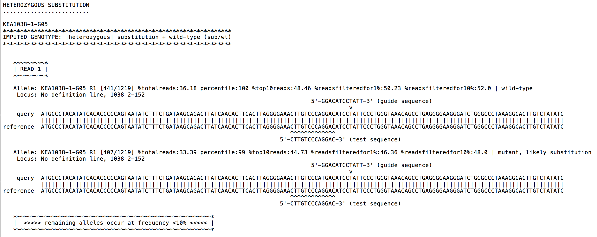
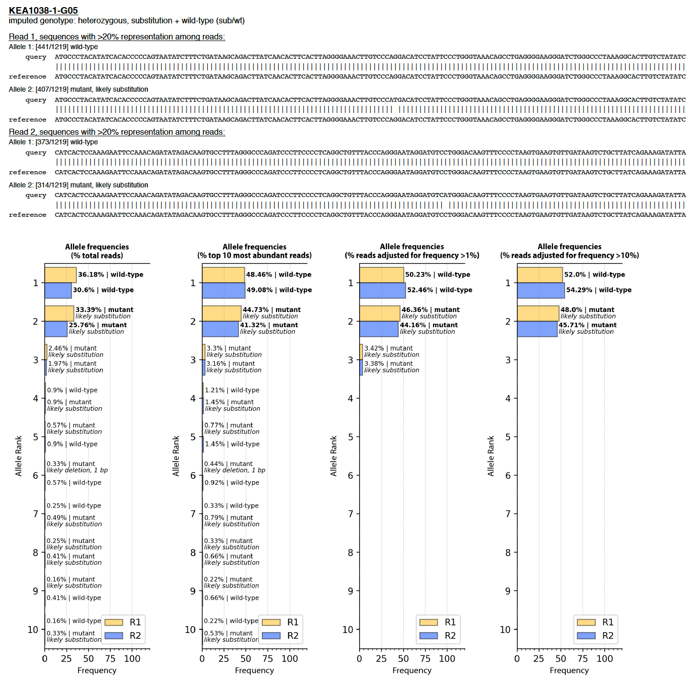

# ImputedGenotypes.py
Define alleles and impute genotypes for deeply sequenced genetic loci (PCR amplicons).

 
## Table of contents
* [Background](#background)
* [Features](#features)
* [Setup](#setup)
* [Requirements](#requirements)
* [Synopsis](#synopsis)
* [Operation notes](#operationnotes)
* [Input notes](#input%20notes)
* [Output notes](#output%20notes)
* [Visual summary of key script operations](#visual%20summary%20of%20key%20script%20operations)
* [Status](#status)
* [Contact](#contact)

## Background
This script returns allele definitions (and imputed genotypes) for amplicons sequenced by Illumina® short-read ('next-generation') sequencing technologies. Users input demultiplexed fastq files for sequenced amplicons and specify BLASTN database to be used as an alignment reference, and the script completes allele definitions (wild-type, deletion, insertion, *etc.*) for the sequenced locus based on relative read abundance in each fastq file. Based on allele definitions, the script also imputes genotype (homozygous, heterozygous) across the sequenced locus for each sample.
 

 
## Features
* Automates allele definitions and imputes genotypes at specific loci, for amplicons deeply sequenced on Illumina® platforms
* Key input: demultiplexed fastq files
* Key outputs: sequence alignments for candidate alleles (reads ranked by abundance), with optional DNA sub-sequence(s) mapped on alignments (*e.g.*, Cas9 guide RNA sequence(s), DNA sub-sequence(s) to test for presence/ablation)

## Setup
Code is available as a Jupyter Notebook file (**ImputedGenotypes.ipynb**) or as a Python program file (**ImputedGenotypes.py**).  

To use: fork and clone this repository to a local destination, or download the file ImputedGenotypes.ipynb or ImputedGenotypes.py.  

Jupyter Notebook file requires *ImputedGenotypes_img* directory containing five image files to be available in the directory from which the Jupyter Notebook was opened.  

*Additional setup*:  

* Locally install **BLASTN** (see Requirements)  

   

* Download or create a **reference sequence database** (required for BLASTN alignment operations)  
*this can be obtained in one of two ways:*  
 * create custom database from a fasta file containing reference sequence(s) using MAKEBLASTDB (NCBI)  
(details at <https://www.ncbi.nlm.nih.gov/books/NBK279688/>)
 * download pre-formatted NCBI BLAST database (details at <https://www.ncbi.nlm.nih.gov/books/NBK537770/>)  
   

 

## Requirements
* Python 3.7 or higher
* BLASTN (NCBI) (available for OS-appropriate download as part of BLAST+ suite @ <a href="https://blast.ncbi.nlm.nih.gov/Blast.cgi?PAGE_TYPE=BlastDocs&DOC_TYPE=Download">Download BLAST Software and Databases</a>)

## Synopsis
**This script returns imputed genotypes for sample-specific amplicons deeply sequenced on Illumina® sequencing platforms.**
>(see 'Output notes' for file output
details).  

**Users are asked for paths to (1) an output directory, (2) fastq directory (sample sequence sources), (3) BLASTN executable, and (4) BLAST reference sequence database (+prefix common to database files), as well as (optional) DNA sub-sequence(s) to query in read alignments (*e.g.*, Cas9 guide RNA sequence(s), DNA test sequence(s)).**

>(see 'Input notes' for details).

For further usage details, please refer to the following manuscript:  
>*Ehmsen, Knuesel, Stenglein, Martinez, Asahina, Aridomi, DeRisi, Yamamoto (2019)*
    
Please cite usage as:  
>ImputedGenotypes.py  
>*Ehmsen, Knuesel, Stenglein, Martinez, Asahina, Aridomi, DeRisi, Yamamoto (2019)*

## Operation notes
*What does this script do?*  

 1. **classify & count reads:** counts unique read types per well (*i.e.*, sample); fastq file name provides the sample name  
 
 
 2. **identify top 10 reads** per well (in terms of read abundance); calculates representation among reads within the well at four levels:
 
   * raw frequency (% read type in question, relative to total reads)  
   * percentile (% of other read types that fall below the frequency of the read type in question)  
   * adjusted frequency @ 1% (% read type in question, relative to reads that occur at >1% frequency)  
   * adjusted frequency @ 10% (% read type in question, relative to reads that occur at >10% frequency)  
   
   
 3. **align to reference database:** aligns top 10 reads to reference database using BLASTN  
 *(National Center for Biotechnology Information;
    Altschul S.F. et al. (1990) "Basic local alignment search tool")*    
    
    
 4. **return alignments as alleles & imputed genotypes;**  
 **(optional) map sub-sequence(s) onto alleles:**  
    -  for mutants, map location of Cas9 cut(s) and indel(s) relative to wt,
       if Cas9 guide sequence(s) supplied by user  
    -  map location of test sub-sequence(s) and whether sub-sequence is altered (ablated),
       if test sub-sequence(s) supplied by user  
       
       
 5. **provide overall population statistics:**  
 
   (a) total sample # for which genotypes were imputed  
   (b) distribution of genotypes among samples (homozygous, heterozygous, *etc.*)  
   (c) estimated wild-type *vs.* mutant allele frequencies  
   (d) summary of samples and reads that either had 'no hit' in reference database provided to BLASTN,
       or multiple hits (>1)  
         
**Operations overview:** *See 
Input notes' and 'Output notes'*  
Files labeled *i-iv* below: Key output files containing script interpretations of sample alleles & genotypes.

 
 

## Input notes
You will be prompted for the following user-specific information (up to 7 items):

   **Required** (4 strings specifying directory or executable locations, 1 string specifying sequence database file prefix):  
      <ul>
      <li>where should output files go?</li>
          *path to* **output directory** *for output files*
      <li>where are input files found?</li>
          *path to single directory containing* **demultiplexed fastq files**                                         
      <li>where is BLASTN executable found?</li>
          *path to* **BLASTN** *installation*
      <li>where is the reference sequence database used for alignment?</li>
          *path to directory containing six files that compose the* **reference sequence database** *used
    for BLASTN alignments (.nhr, .nin, .nog, .nsd, .nsi, .nsg)*
      <li>what prefix is common to the six files that compose the reference sequence database?</li>
          *prefix common to database files .nhr, .nin, .nog, .nsd, .nsi, .nsg*
      </ul>
                                                                                                           
   **Optional** (up to 2 lines of comma-separated strings specifying DNA sub-sequence(s):    
 **DNA sub-sequence(s)** to be mapped onto sequence alignments
      <ul>
      <li>**guide RNA sequence** (in 5'-3' DNA representation, excluding PAM sequence)</li>
      <li>**test sequence** (5'-3' sub-sequence motif(s) of interest, to query whether lost or gained in allele(s))</li>
      </ul>  

## Output notes  
This script produces **8 output files** in the user-specified output directory.  
These include:  

1. **fasta.fa**  
        (collection of fasta entries representing top 10 most abundant sequences assigned to a single sample ID)  
        
2. **blastn_alignments.txt**  
        (output of blastn operation on fasta.fa)
     
3. **allele\_definitions.txt**  
        (output of script operation on blastn\_alignments.txt, samples returned in order of processing)  
        
4. **allele\_evidence.pdf**  
        (output of script operation on blastn\_alignments.txt, plots of calculated read/allele frequencies)  
        
5. **imputed\_genotypes.txt**  
        (output of script operation on blastn\_alignments.txt, samples returned in ranked order based on  
        genotype imputation)  
        
6. **allele\_definitions.csv**  
        (tabular representation of allele data for all samples)  

7. **population\_summary.txt**  
        (output of script operation on imputed\_genotypes.txt)  
        
8. **script\_metrics.txt**  
        (summary/analysis of script operation metrics [metadata])  

  Directory structure under an output directory specified as 'ImputedGenotypes', for example,  
           would contain the following files after ImputedGenotypes.py operations:  

           /ImputedGenotypes  
                          `-----allele_definitions.csv  
                          `-----allele_definitions.txt  
                          `-----allele_evidence.pdf  
                          `-----blastn_alignments.txt  
                          `-----fasta.fa  
                          `-----imputed_genotypes.txt  
                          `-----population_summary.txt  
                          `-----script_metrics.txt

## Visual summary of key script operations  
In short, sequencing data in a sample-specific **fastq file** (*e.g.*, below), are converted to user-interpretable  genotype imputations (**key output files**, below), for 100s to 1000s of samples.    
  

   
*example*  

------
#### Key output files:  
##### allele_definitions.txt 
Samples are reported with sequence alignments to document alleles, along with imputed genotypes. 

 
##### allele_evidence.pdf
Samples are reported with frequency plots as evidence.
  
 

## Status
Project is:  _finished_, _open for contributions_

## Contact
Created by kirk.ehmsen[at]gmail.com - feel free to contact me!    
Keith Yamamoto laboratory, UCSF, San Francisco, CA.